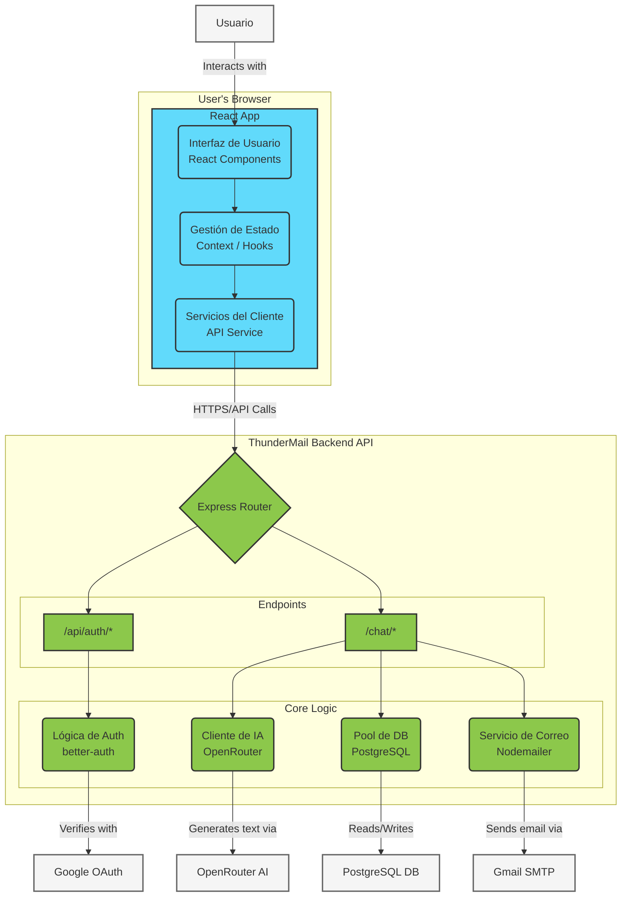
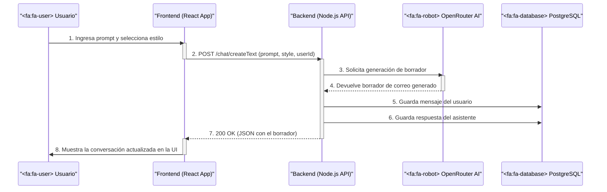

# ThunderMail: Asistente Inteligente de Redacción de Correos

**ThunderMail** es una aplicación web moderna que revoluciona la forma en que escribes correos electrónicos. Utilizando el poder de la inteligencia artificial, ThunderMail te ayuda a generar borradores de correo electrónico completos y bien estructurados a partir de simples instrucciones. Simplemente indica el destinatario, el propósito del mensaje y el tono deseado (formal, directo, informal o divertido), y deja que la IA haga el resto.

La aplicación no solo genera el contenido, sino que también te permite editarlo y enviarlo directamente desde la interfaz, agilizando tu flujo de trabajo y mejorando tu productividad.

## 🚀 Live Demo

**¡Prueba ThunderMail ahora mismo!** La aplicación está desplegada y disponible para su uso.

### [thunder-mail.vercel.app](https://thunder-mail.vercel.app/)

## ✨ Características Principales

- **Redacción Asistida por IA:** Genera borradores de correo electrónico (destinatario, asunto y contenido) a partir de prompts en lenguaje natural.
- **Múltiples Estilos de Tono:** Adapta el lenguaje del correo eligiendo entre estilos: **Formal, Informal, Directo y Divertido**.
- **Autenticación Segura:** Inicio de sesión rápido y seguro con tu cuenta de Google.
- **Gestión de Chats:** Todas tus conversaciones se guardan y se organizan en un historial de chats, con la posibilidad de buscar y eliminar conversaciones.
- **Edición y Envío Integrado:** Edita los borradores generados por la IA directamente en la interfaz y envíalos con un solo clic.
- **Interfaz Moderna y Responsiva:** Una experiencia de usuario limpia, intuitiva y totalmente adaptable a dispositivos móviles y de escritorio.
- **Sistema de Fallback de Modelos:** Arquitectura robusta que reintenta la generación de texto con un modelo de IA secundario si el principal falla, garantizando una alta disponibilidad.

## 🛠️ Stack Tecnológico

ThunderMail está construido con una arquitectura de monorepo, separando claramente las responsabilidades del frontend y el backend para una mayor escalabilidad y mantenibilidad.

### Frontend

- **Framework:** [React 19](https://react.dev/) con [Vite](https://vitejs.dev/)
- **Lenguaje:** [TypeScript](https://www.typescriptlang.org/)
- **Estilos:** [Tailwind CSS](https://tailwindcss.com/)
- **Componentes UI:** [Shadcn UI](https://ui.shadcn.com/) y [Lucide React](https://lucide.dev/) para iconos.
- **Gestión de Estado:** React Context API y hooks personalizados.
- **Notificaciones:** [React Toastify](https://fkhadra.github.io/react-toastify/introduction)

### Backend

- **Framework:** [Node.js](https://nodejs.org/) con [Express](https://expressjs.com/)
- **Lenguaje:** JavaScript (ESM)
- **Base de Datos:** [PostgreSQL](https://www.postgresql.org/)
- **Autenticación:** [Better-Auth](https://better-auth.dev/) para la gestión de sesiones y OAuth con Google.
- **Generación de IA:** Integración con [OpenRouter AI](https://openrouter.ai/) para acceder a diversos modelos de lenguaje.
- **Envío de Correos:** [Nodemailer](https://nodemailer.com/)

## 🏗️ Arquitectura y Flujo de Datos

#### Diagrama de Arquitectura

Este diagrama muestra los componentes principales de ThunderMail y cómo interactúan entre sí y con servicios externos.

```mermaid
graph TD;
    %% --- Definición de Estilos ---
    classDef frontendStyle fill:#61DAFB,stroke:#333,stroke-width:2px,color:#333;
    classDef backendStyle fill:#8CC84B,stroke:#333,stroke-width:2px,color:#333;
    classDef dbStyle fill:#FFD43B,stroke:#333,stroke-width:2px,color:#333;
    classDef externalStyle fill:#F5F5F5,stroke:#666,stroke-width:2px,color:#333;

    %% --- Actores y Servicios Externos ---
    User["<fa:fa-user> Usuario"];
    Ext_Google["<fa:fa-google> Google OAuth"];
    Ext_DB["<fa:fa-database> PostgreSQL DB"];
    Ext_AI["<fa:fa-robot> OpenRouter AI"];
    Ext_Gmail["<fa:fa-envelope> Gmail SMTP"];

    %% --- Frontend (Navegador del Usuario) ---
    subgraph User's Browser
        direction LR
        subgraph Frontend [React App]
            direction TB
            FE_UI("Interfaz de Usuario <br/> React Components")
            FE_State("Gestión de Estado <br/> Context / Hooks")
            FE_Services("Servicios del Cliente <br/> API Service")
        end
    end

    %% --- Backend (Servidor Vercel) ---
    subgraph ThunderMail Backend API
        direction TB
        BE_Router{Express Router};
        subgraph Endpoints
            direction LR
            BE_Auth_EP["/api/auth/*"]
            BE_Chat_EP["/chat/*"]
        end
        subgraph Core Logic
            direction LR
            BE_Auth_Logic("Lógica de Auth <br/> better-auth")
            BE_AI_Client("Cliente de IA <br/> OpenRouter")
            BE_DB_Pool("Pool de DB <br/> PostgreSQL")
            BE_Mailer("Servicio de Correo <br/> Nodemailer")
        end
    end

    %% --- Conexiones ---
    User -- Interacts with --> FE_UI;
    FE_UI --> FE_State;
    FE_State --> FE_Services;
    
    FE_Services -- "HTTPS/API Calls" --> BE_Router;
    
    BE_Router --> BE_Auth_EP;
    BE_Router --> BE_Chat_EP;

    BE_Auth_EP --> BE_Auth_Logic;
    BE_Chat_EP --> BE_AI_Client;
    BE_Chat_EP --> BE_DB_Pool;
    BE_Chat_EP --> BE_Mailer;

    BE_Auth_Logic -- "Verifies with" --> Ext_Google;
    BE_DB_Pool -- "Reads/Writes" --> Ext_DB;
    BE_AI_Client -- "Generates text via" --> Ext_AI;
    BE_Mailer -- "Sends email via" --> Ext_Gmail;

    %% --- Aplicar Estilos ---
    class User,Ext_Google,Ext_DB,Ext_AI,Ext_Gmail externalStyle;
    class Frontend,FE_UI,FE_State,FE_Services frontendStyle;
    class BE_Router,BE_Auth_EP,BE_Chat_EP,BE_Auth_Logic,BE_AI_Client,BE_DB_Pool,BE_Mailer backendStyle;
```

#### Flujo: Generación de un Borrador de Correo

Este diagrama de secuencia detalla los pasos que ocurren cuando un usuario solicita la creación de un correo.

```mermaid
sequenceDiagram
    participant User as "<fa:fa-user> Usuario"
    participant Frontend as "Frontend (React App)"
    participant Backend as "Backend (Node.js API)"
    participant OpenRouter as "<fa:fa-robot> OpenRouter AI"
    participant Database as "<fa:fa-database> PostgreSQL"

    User->>Frontend: 1. Ingresa prompt y selecciona estilo
    
    activate Frontend
    Frontend->>Backend: 2. POST /chat/createText (prompt, style, userId)
    deactivate Frontend
    
    activate Backend
    Backend->>OpenRouter: 3. Solicita generación de borrador
    
    activate OpenRouter
    OpenRouter-->>Backend: 4. Devuelve borrador de correo generado
    deactivate OpenRouter
    
    Backend->>Database: 5. Guarda mensaje del usuario
    Backend->>Database: 6. Guarda respuesta del asistente
    
    Backend-->>Frontend: 7. 200 OK (JSON con el borrador)
    deactivate Backend
    
    activate Frontend
    Frontend->>User: 8. Muestra la conversación actualizada en la UI
    deactivate Frontend
```

---

*Desarrollado con ❤️ por [GuilleAlvareez](https://github.com/GuilleAlvareez)*
